<h1 align="center">☁️ Cloudflare Wiki</h1>

<p align="center">
  <strong>运行在 Cloudflare 边缘网络上的双语 Markdown Wiki。</strong><br>
  一个公开知识库，一个管理员，一个 Worker。
</p>

<p align="center">
  <a href="https://developers.cloudflare.com/workers/"></a>
  <a href="https://www.typescriptlang.org/"></a>
  <a href="LICENSE"></a>
  <a href="https://github.com/jacklilyhello/cloudflare-wiki/actions/workflows/ci.yml"></a>
  <a href="https://github.com/jacklilyhello/cloudflare-wiki/stargazers"></a>
</p>

<p align="center">
  <a href="README.md">English</a> · <strong>简体中文</strong><br>
  <a href="https://emby.wiki/">在线演示</a> · <a href="#部署">部署指南</a> · <a href="https://github.com/jacklilyhello/cloudflare-wiki/issues">问题反馈</a> · <a href="https://hellogithub.com/user/IDCJ570U6V8P4sn">HelloGitHub 主页</a>
</p>

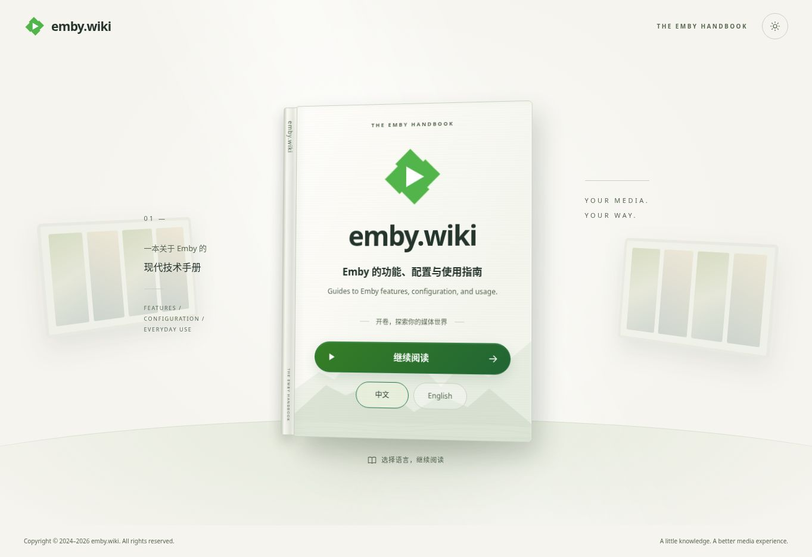

Cloudflare Wiki 是使用 **React、TypeScript、Cloudflare Workers、D1 和私有 R2** 构建的文档与知识库应用。在后台编写 Markdown、实时预览并发布，读者可以通过双语导航、目录和全文搜索查找内容。

**[emby.wiki](https://emby.wiki/)** 是项目的实际运行示例。项目用于搭建文档站，不会安装或运行 Emby 媒体服务器。界面参考了文档站的阅读布局和 Wiki.js 的编辑交互，代码为独立实现。

> [!IMPORTANT]
> 当前上游部署专门面向 emby.wiki 及其已有资源。**Fork 后仅填写 Secrets，不能直接部署新站点。** 需要在自己的 Fork 中调整仓库、域名、规范来源和存储校验，并补充独立的首次初始化工作流。请阅读[部署说明](#部署)和[详细部署指南](docs/deployment.md#中文)。

<details>
<summary><strong>目录</strong></summary>

- [在线演示](#在线演示)
- [功能](#功能)
- [界面预览](#界面预览)
- [技术架构](#技术架构)
- [部署](#部署)
- [本地开发](#本地开发)
- [常见问题](#常见问题)
- [安全与运维](#安全与运维)
- [参与贡献](#参与贡献)
- [相关链接与致谢](#相关链接与致谢)
- [开源许可](#开源许可)

</details>

## 在线演示

| 体验 | 地址 |
| --- | --- |
| 手册封面与语言选择 | [emby.wiki](https://emby.wiki/) |
| 中文文档 | [中文阅读](https://emby.wiki/zh/home) |
| 英文文档 | [English reader](https://emby.wiki/en/home) |
| 管理员入口 | [管理工作台](https://emby.wiki/admin)——仅站点所有者可登录 |

公开站点可以直接阅读；下方后台截图来自所有者的工作台，不提供共享管理员账号。新数据库会从迁移获得初始示例文章，**不会自动复制当前演示站的文章库**。

## 功能

| | 你可以做什么 |
| --- | --- |
| 📖 阅读 | 服务端渲染文章，使用层级导航、面包屑、目录、标题锚点、代码复制和图片查看器 |
| 🌏 双语 | 管理中英文文章及翻译关联；两种语言拥有独立导航和搜索结果 |
| ✍️ 编辑 | 使用 Monaco Markdown 编辑器，在编辑、分栏和预览模式间切换，填写标签及修改说明 |
| 🗂️ 发布 | 分开保存草稿与发布；查看不可变版本记录、比较源码，并恢复为新草稿 |
| 🧭 组织 | 浏览页面目录、确认后移动目录树、编辑导航，以及管理随页面移动更新的内部重定向 |
| 🖼️ 文件 | 上传到私有 R2，管理文件夹、预览图片、填写双语替代文本，明确发布后插入 Markdown |
| 🔎 搜索 | 使用 D1 FTS5 搜索已发布文章的标题、描述、标签、路径和正文；草稿不进入公开结果 |
| 🎨 外观 | 使用浅色/深色主题、响应式布局、双语站点设置、强调色及可选部署品牌资源 |
| 🔐 管理 | 单管理员登录、受保护会话、CSRF/来源校验、版本冲突检测和只读审计记录 |
| 💾 运维 | 通过 GitHub Actions 验证与部署，进行私有备份、隔离恢复演练和独立管理员恢复 |

Markdown 支持 GFM 表格与任务列表、脚注、语法高亮、内部 Wiki 链接、提示块、选项卡、KaTeX 公式和 Mermaid 图表。阅读页与编辑预览共用经过净化的渲染流程。

目前支持 **一个管理员、两种语言（`zh` / `en`）**。不包含注册、普通用户账号、评论、团队权限和多人协作编辑。翻译由管理员编写并关联，不包含自动翻译。

## 界面预览

以下图片为 2026 年 10 月 2 日在云端浏览器中截取的 emby.wiki 前台与已登录后台。站点品牌和文章内容仅作示例；后台界面也可以切换中英文。

### 中文阅读

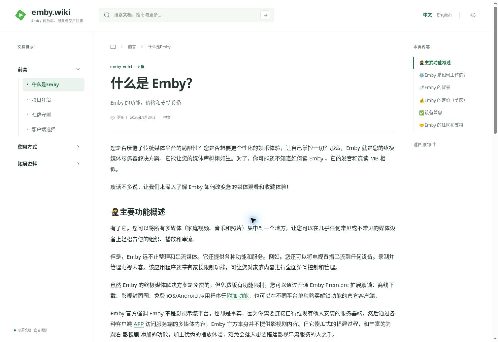

### 英文阅读

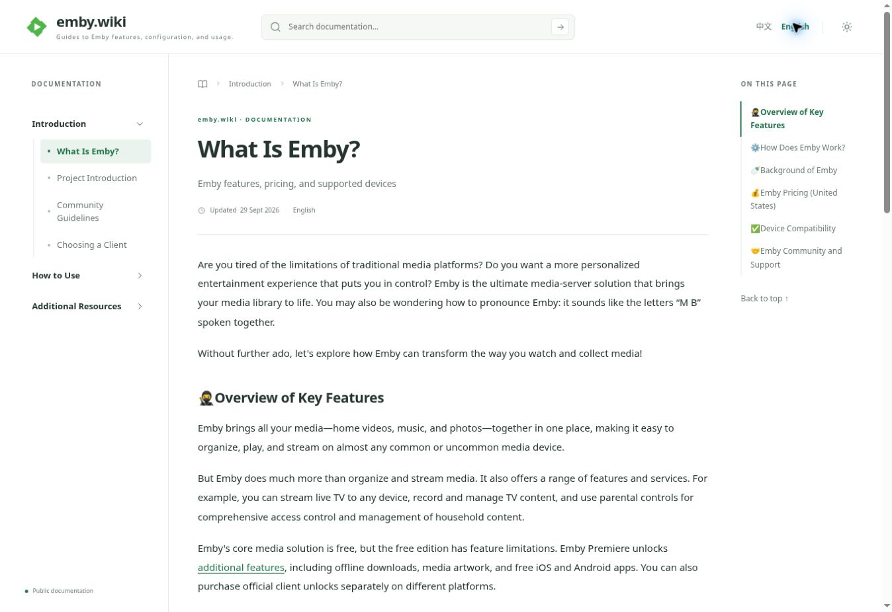

### 深色主题

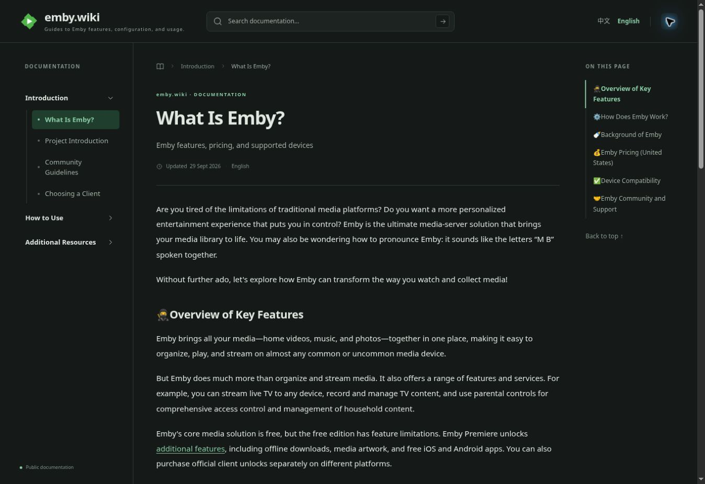

### 全文搜索

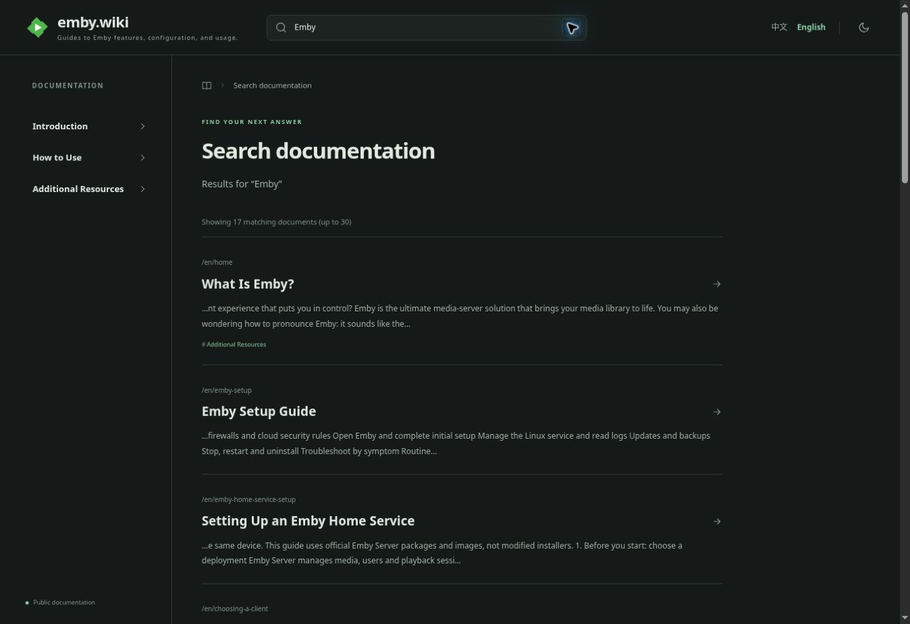

### 管理员登录

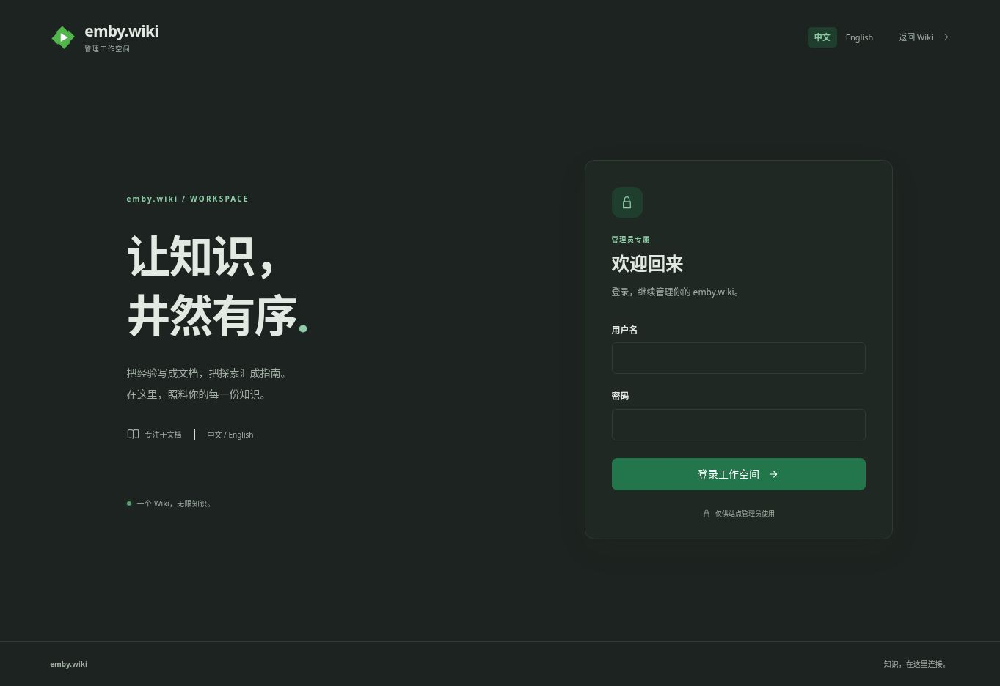

### 管理概览

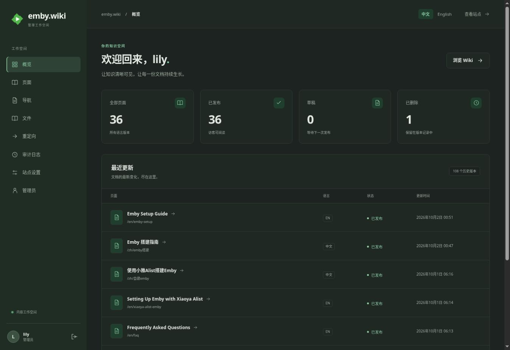

### 页面目录

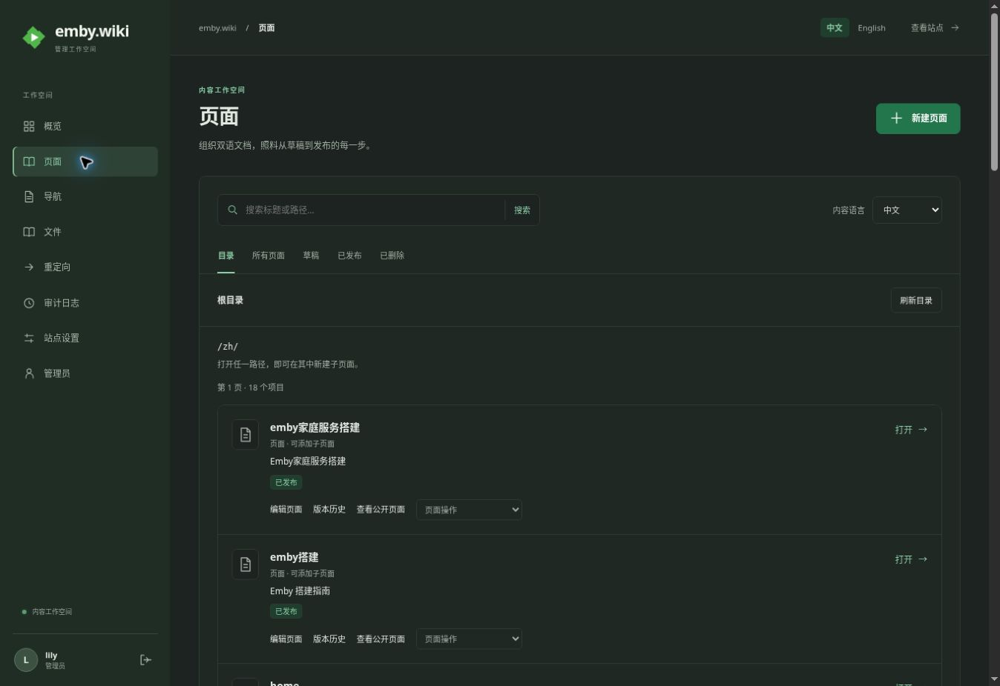

### Markdown 编辑与实时预览

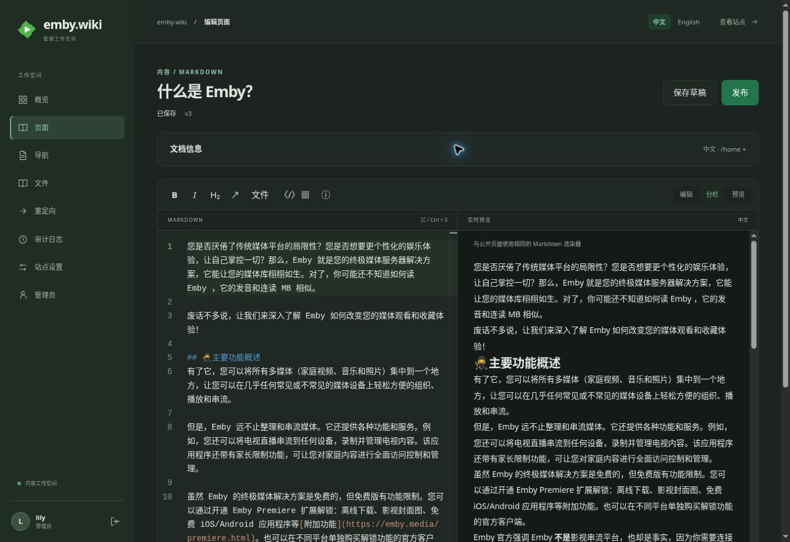

### 版本历史与源码对比

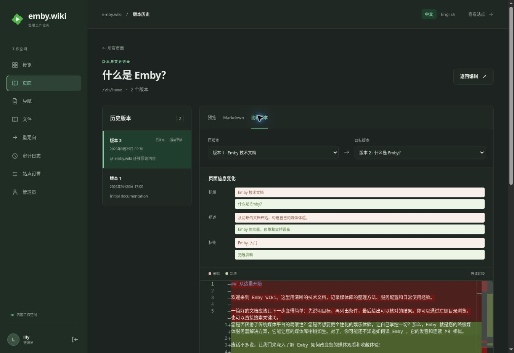

### 可视化导航编辑

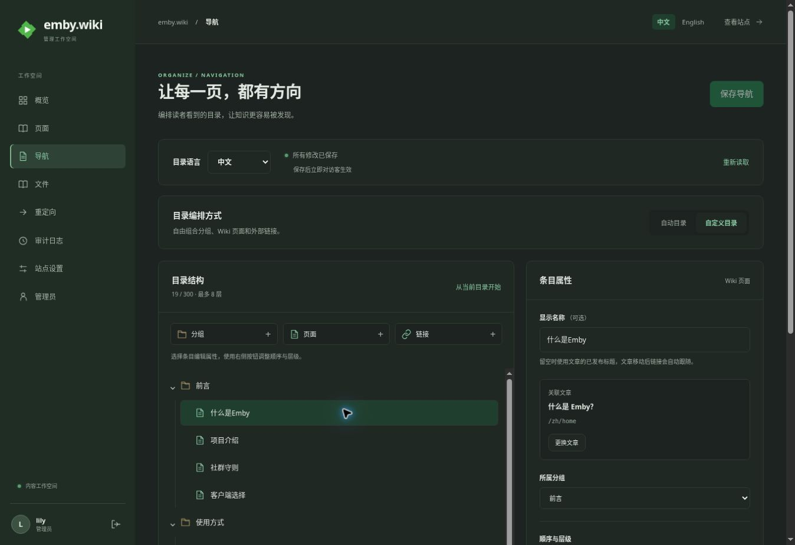

### 文件管理

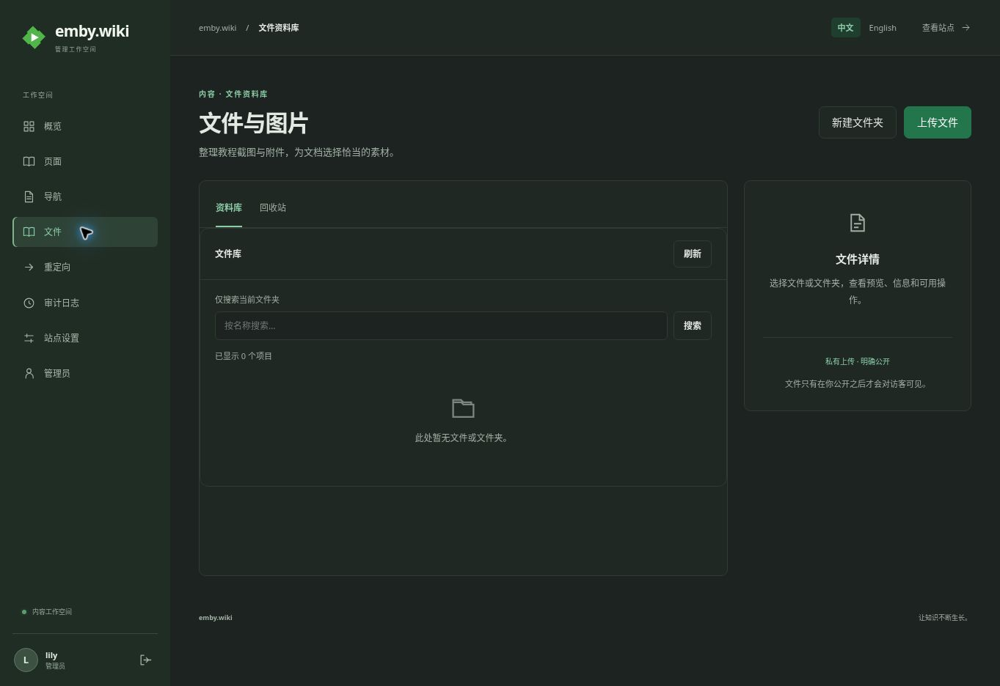

### 重定向管理

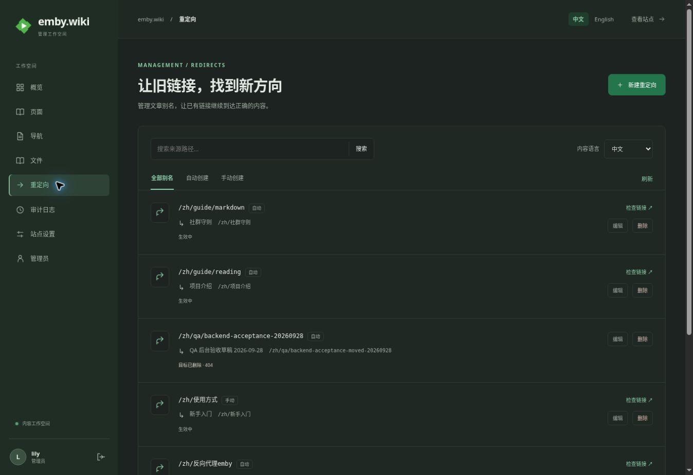

### 站点设置与部署品牌

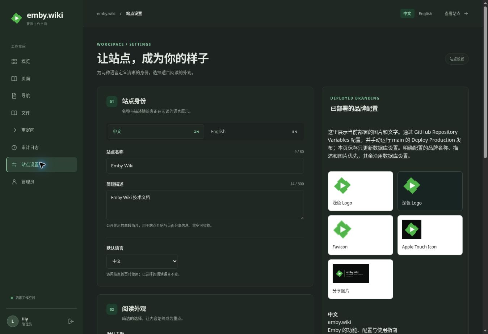

### 审计记录

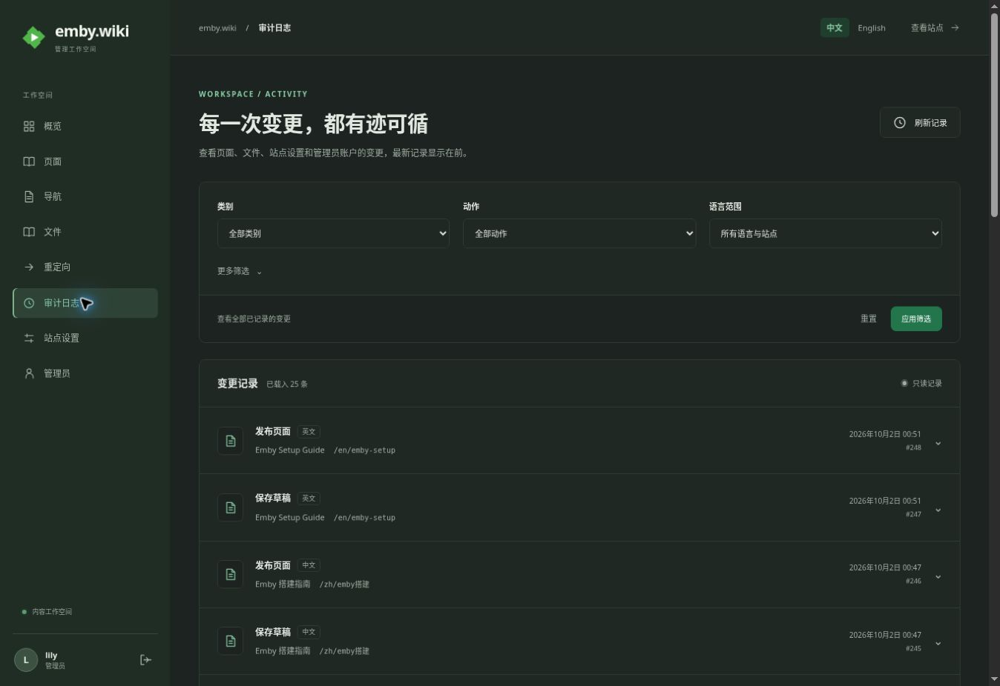

### 管理员账号

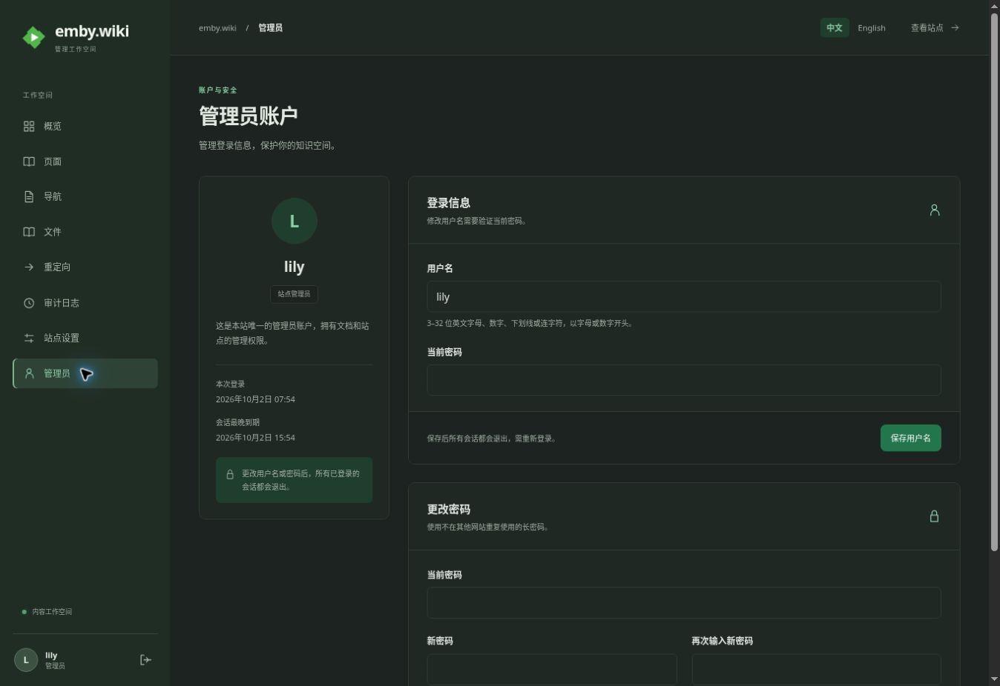

## 技术架构

| 组件 | 用途 |
| --- | --- |
| React 19 + TypeScript + Vite 8 | 阅读页、浏览器交互和按需加载的后台界面 |
| Cloudflare Workers | 服务端文章渲染、身份验证、公开与后台 API |
| Workers Static Assets | 同源脚本、样式、编辑器 Worker 和品牌资源 |
| Cloudflare D1 | 文章、翻译、草稿、版本、搜索、导航、重定向、设置、文件元数据与认证状态 |
| 私有 Cloudflare R2 | 不可变附件对象、缩略图与私有备份归档 |
| GitHub Actions | CI、部署、备份验证与受控恢复 |

生产环境采用 **单 Worker + D1 + R2 绑定**，无需 VPS、常驻 Node 服务、外部数据库或单独的 Cloudflare Pages 项目。开发与 CI 使用 Node 24；当前实现不需要 KV、Workers AI、Queues 或 Durable Objects。

事务、渲染、文件服务和会话的详细设计见[实现参考](docs/implementation.md)。

## 部署

### 准备资源

| 资源 | 用途 | 入口 |
| --- | --- | --- |
| Cloudflare 账号 | 持有 Worker、D1 和 R2 资源 | [Cloudflare 控制台](https://dash.cloudflare.com/) |
| 已激活的 DNS 区域 | 配置自己的域名 | 控制台 → 选择域名 |
| 一个 Worker | 承载应用与静态资源 | Workers & Pages |
| 一个 D1 数据库 | 保存 Wiki 和管理员状态 | Storage & databases → D1 |
| 一个私有 R2 存储桶 | 保存文件与备份 | R2 object storage |
| 已启用 Actions 的 GitHub 仓库 | 运行 CI 和云端写操作 | 仓库 → Actions |

账号需开通 R2。存储桶保持私有，**关闭 r2.dev 访问，不配置公开自定义域名**；公开文件由应用提供。额度、费用和开通条件取决于自己的 Cloudflare 套餐，参见 [Workers](https://developers.cloudflare.com/workers/platform/pricing/)、[D1](https://developers.cloudflare.com/d1/platform/pricing/) 和 [R2](https://developers.cloudflare.com/r2/pricing/) 官方说明，项目不承诺零费用。

### GitHub Secrets 与 Variables

进入仓库 → **Settings → Secrets and variables → Actions**。

[上游配置页面](https://github.com/jacklilyhello/cloudflare-wiki/settings/secrets/actions)。部署 Fork 时，请进入**自己的仓库**相同路径；Fork 不会继承上游的 Secret 或 Variable 值。

API Token 填在 **Secrets → New repository secret**；其余四项填在 **Variables → New repository variable**：

| 类型 | 名称 | 填什么 | 在哪里找到 |
| --- | --- | --- | --- |
| Secret | `CLOUDFLARE_API_TOKEN` | 部署 API Token，值必须保密 | Cloudflare → 个人资料 → API Tokens → Create Token → Custom token |
| Variable | `CLOUDFLARE_ACCOUNT_ID` | 32 位账号 ID | 域名 Overview → API 区域 → Account ID，或账号详情 |
| Variable | `CLOUDFLARE_ZONE_ID` | 32 位 DNS 区域 ID | 域名 Overview → API 区域 → Zone ID |
| Variable | `CLOUDFLARE_WORKER_NAME` | 上游为 `cloudflare-wiki`；Fork 填自己已调整策略的独立 Worker 名 | 在 Fork 的部署策略中确定；这是名称，不是 Worker ID |
| Variable | `PRODUCTION_DOMAIN` | 上游为 `emby.wiki`；Fork 例如 `wiki.example.com` | 选定区域中的主机名，不带 `https://`、路径或结尾斜杠 |

如果部署 `wiki.example.com`，Zone ID 应属于 **example.com**。资源应归属于所填账号，ID 获取位置也可参考 [Cloudflare 官方指南](https://developers.cloudflare.com/fundamentals/account/find-account-and-zone-ids/)。

上游从现有 Worker 绑定解析真实 D1 UUID，**不读取名为 `CLOUDFLARE_DATABASE_ID` 的 Secret**。`wrangler.jsonc` 中的全零 UUID 是本地占位值；新站点初始化需要解析并绑定自己的真实 UUID。

<details>
<summary><strong>可选：首次初始化、品牌资源与账号恢复</strong></summary>

| 类型 | 名称 | 用途 |
| --- | --- | --- |
| Secret | `ADMIN_SETUP_TOKEN` | 独立首次初始化工作流使用的一次性令牌；普通 Deploy Production 不读取它 |
| Variable | `WIKI_BRAND_MANIFEST` | 可选部署品牌的资源清单 |
| Variable | `WIKI_BRAND_LOGO_LIGHT_B64` | 处理后的浅色 Logo |
| Variable | `WIKI_BRAND_LOGO_DARK_B64` | 处理后的深色 Logo |
| Variable | `WIKI_BRAND_FAVICON_B64` | 处理后的 favicon |
| Variable | `WIKI_BRAND_APPLE_TOUCH_B64` | 处理后的 Apple Touch Icon |
| Variable | `WIKI_BRAND_OG_IMAGE_B64` | 处理后的分享图片 |

初始化令牌需要至少 32 个随机字节，编码为不带补位的 base64url。保存在密码管理器和初始化 Secret 中，不放进源码、Worker 变量、URL 或日志。初始化窗口为 24 小时，成功创建管理员后即被消耗。

品牌资源的格式、生成与大小限制见[品牌配置指南](docs/branding.md)。现有安装脚本写向上游仓库，Fork 使用前要调整目标。基本站点名称、主题和强调色也可在后台设置。[管理员恢复手册](docs/administrator-recovery.md)另行说明受保护的 GitHub Environment 和 Secret。

</details>

### Cloudflare API Token 权限

创建**专用部署 Token**，限制到目标账号与 DNS 区域。建议每个 Fork 单独使用一个 Token，便于撤销；不使用 Global API Key，也不把 Actions 的部署 Token 下载到本地开发环境。

上游普通工作流部署 Worker、管理 Custom Domains，并只读检查已有存储：

| 范围 | 权限 | 用途 |
| --- | --- | --- |
| Account | 产品级 Workers **Editor**；旧界面为 **Workers Scripts → Edit** | 部署代码/静态资源、读取配置；当前 Custom Domain 支持需要产品级范围 |
| Account | **D1 → Read** | 检查已有数据库、归属标记和迁移记录 |
| Account | **Workers R2 Storage → Read** | 检查私有存储桶、归属标记与公开域名状态 |
| Zone | **Workers Routes → Write / Edit** | 管理 Custom Domains、检查冲突路由 |
| Zone | **Zone → Read** | 校验区域、账号与激活状态 |
| Zone | **DNS → Read** | 绑定域名前检查 DNS 记录 |

**首次创建资源**还需要产品级 **Workers Admin**（或旧 Workers Scripts Edit 等效权限）用于创建 Worker、**D1 Write / Edit** 用于建库/迁移/初始化，以及 **Workers R2 Storage Write / Edit** 用于建桶和写入标记。私有备份工作流也需要 R2 写权限。尽可能将初始化/恢复权限与日常部署权限分开。

资源范围选择 **Include → Specific account → 自己的账号**，以及 **Include → Specific zone → 自己的区域**。旧权限界面中的 `Edit` 对应写权限。Wrangler 发现账号时可能还需 Account Settings Read；遇到 403 时应根据失败操作检查，避免无依据增加写权限。项目不需要 KV、Email Routing、Workers AI 或账单写权限。

Cloudflare 正在引入 Workers 新角色，控制台名称可能有所变化；参见官方 [Workers 权限指南](https://developers.cloudflare.com/workers/authorization/workers/)和 [API Token 权限表](https://developers.cloudflare.com/fundamentals/api/reference/permissions/)。

### 在 Fork 中部署新站点

**当前是需要开发者调整的部署方式，尚无一键初始化器。** 仓库保留了原站点的明确部署限制。

1. [Fork 仓库](https://github.com/jacklilyhello/cloudflare-wiki/fork)，在自己的 Fork 中启用 Actions。
2. 选择独立的 Worker、D1 名称、私有 R2 存储桶和主机名。即使同属一个账号，新站也需要独立的资源和管理员状态。
3. 填写上面五个必填配置，检查首次初始化所需权限。
4. 在 Fork 中调整仓库/资源白名单、运行时规范来源校验、Zone 校验、构建路径和域名相关的冒烟测试。[详细指南](docs/deployment.md#中文)列出了对应文件；只改 `PRODUCTION_DOMAIN` 不够。
5. 补充经过审查、手动触发且只允许 main 的**首次初始化工作流**，调用已有资源初始化与管理员引导模块：创建/验证归属资源、应用迁移、绑定真实 D1 UUID，写入一次性令牌摘要。普通生产部署会拒绝缺失资源和未完成迁移。
6. 验证后运行初始化，检查 Actions 结果及 Cloudflare 绑定。明确处理 DNS/域名冲突，不接管其他项目的数据库或存储桶。
7. 打开 `https://自己的域名/admin` 完成一次性初始化，创建唯一管理员，验证双语阅读、搜索、编辑、发布和文件访问。
8. 后续更新继续走普通部署的存储只读校验路径；另行调整 Fork 的备份与恢复工作流。

[详细部署指南](docs/deployment.md)说明了改动位置和初始化模块接口。未修改的 Fork 尚未作为新账号的一键部署方案验证。

### 更新现有上游站点

| 配置 | 当前值 |
| --- | --- |
| 仓库 | `jacklilyhello/cloudflare-wiki` |
| Worker | `cloudflare-wiki` |
| Custom Domains | `emby.wiki`、`www.emby.wiki`、`cf.emby.wiki` |
| 规范来源 | `https://emby.wiki` |
| 已有 D1 | `cloudflare-wiki-test` |
| 已有私有 R2 | `cloudflare-wiki-assets-test` |

历史资源名的 `-test` 后缀不决定运行环境；Worker 使用 `APP_ENV=production`。不要为了去掉后缀而替换现有资源。

修改通过分支与 PR，并通过 **CI**。获得授权并 squash merge 后，main 的推送触发 **Deploy Production**：验证 → 域名/存储预检 → 部署 → 配置读回校验 → 三个域名的匿名浏览器冒烟检查。也可进入 **Actions → Deploy Production → Run workflow → main** 手动执行。

PR 不部署；`workers.dev` 和 Preview URLs 保持关闭。已有 `www` 跳转属于独立 Cloudflare 配置，Custom Domain 本身不会建立跳转。普通部署不创建资源、不执行远程迁移、不清空数据、不重置管理员。

## 本地开发

使用 **Node 24** 和 npm，无需生产凭证：

```sh
git clone https://github.com/jacklilyhello/cloudflare-wiki.git
cd cloudflare-wiki
npm ci
npm run dev
```

打开 Vite 输出的地址。该命令应用本地迁移，使用本地 D1/R2 与 workerd；重复运行保留本地数据。`content/` 中是初始 Markdown 参考，修改它不会覆盖数据库中已保存的文章。

```sh
npm run verify
```

该命令包含 lint、格式检查、Worker 类型生成、TypeScript、运行时/部署策略测试、构建和本地 HTTP 冒烟检查。也可以单独运行 `npm test`、`npm run build`、`npm run db:local`、`npm run test:preview`。

本地迁移不会自动开放管理员初始化，认证测试使用隔离数据。`npm run deploy:production` 会拒绝本地执行；真实 Cloudflare 写操作统一在 Actions 中进行。

## 常见问题

| 现象 | 检查方向 |
| --- | --- |
| Fork 的部署任务被跳过 | 两个部署工作流仍限定上游仓库；按 Fork 指南调整 |
| 域名/Worker 校验失败 | Variable 与显式策略常量不一致，新域名需要完整一致的配置 |
| 改了域名变量，新站仍返回 503 | `shared/branding.ts` 的规范来源校验仍限定原站，需要一起调整 |
| Cloudflare API 返回 403 | 检查有效期、账号/区域范围及失败操作的权限；区域访问限制也可能返回 403，要结合错误上下文 |
| 空数据库未通过存储预检 | 普通部署要求已有归属资源与完整迁移记录；新站需要独立初始化 |
| 后台没有初始化表单 | 检查引导摘要是否写入、初始化状态、令牌有效期以及是否已消耗 |
| 图片/附件返回 404 | 检查上传是否完成和是否已明确发布，私有文件不能用于公开插入 |
| 保存返回 412 | 版本已被其他操作更新，重新加载并对比后再提交 |
| 保存/移动返回 409 | 翻译、页面或保留路径与目标发生冲突 |
| CI/浏览器冒烟失败 | 阅读失败任务与断言，修复原因并保留测试和部署校验 |

## 安全与运维

- 公开接口仅返回已发布内容；草稿、私有文件和版本历史需要管理员权限。
- 密码使用带盐 scrypt 摘要；会话 Cookie 具有 Secure、HttpOnly、SameSite=Strict 属性，凭证修改会撤销会话。
- 后台写操作检查会话、精确来源、CSRF 与预期版本，拒绝过期修改。
- Markdown 经过净化和渲染限制，阅读与预览共用流程，Mermaid 使用严格设置。
- 文件发布是明确操作，R2 保持私有。凭证不应放进 `VITE_*`、源码、截图或日志。
- [备份/隔离恢复](docs/backup-restore.md)、[管理员恢复](docs/administrator-recovery.md)和[品牌配置](docs/branding.md)各有独立手册；恢复不会暴露公开重置密码接口。

这些是现有实现中的防护机制，项目尚未声明通过独立安全审计。疑似漏洞请先私下联系维护者，避免公开泄露可利用细节。

## 参与贡献

欢迎问题报告、文档改进和范围明确的 PR。请提供复现步骤、运行环境/浏览器信息及已去除敏感数据的日志。

阅读 [AGENTS.md](AGENTS.md)、[codex.md](codex.md)和[实现参考](docs/implementation.md)，使用任务分支，运行 `npm ci` 与 `npm run verify`，将验证记录放在 PR 中。不要提交凭证、数据库转储或私有文件。

## 相关链接与致谢

- [在线示例：emby.wiki](https://emby.wiki/)
- [源码、Issues 与 Pull Requests](https://github.com/jacklilyhello/cloudflare-wiki)
- [维护者的 HelloGitHub 主页](https://hellogithub.com/user/IDCJ570U6V8P4sn)
- [Wiki.js](https://js.wiki/)——界面与交互参考
- [Cloudflare 开发者文档](https://developers.cloudflare.com/)
- [Monaco Editor](https://microsoft.github.io/monaco-editor/)、[Mermaid](https://mermaid.js.org/) 与 [KaTeX](https://katex.org/)

如果项目对你有帮助，欢迎点个 Star，让更多人发现它。

## 开源许可

项目代码及原创仓库文档采用 **[MIT License](LICENSE)**。依赖保留各自许可证；演示站中的第三方品牌、标识和内容保留各自权利，代码许可不授予这些第三方素材的使用权。
