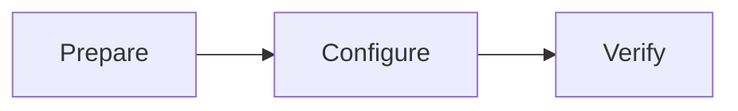

## Text and lists

Markdown keeps content and structure in readable plain text. Use **bold**, *emphasis*, ~~strikethrough~~, and inline code such as `library.json`.

- Keep one step in each paragraph.
- Put configuration examples beside their explanations.
- Give each section a heading that describes its purpose.

Task lists communicate verification steps:

- [x] Read the prerequisites
- [x] Review the configuration example
- [ ] Verify in your own environment

## Code and tables

Code blocks can specify a language. The copy button copies only the code.

```json
{
  "library": "example-library",
  "folders": ["/path/to/media"],
  "enabled": true
}
```

| Format | Purpose |
| :--- | :--- |
| Inline code | Fields, filenames, and short commands |
| Code block | Complete configuration or multiline examples |
| Table | Compare parameters, options, and results |

## Callouts and disclosure

> [!NOTE]
> A note adds context. Keep essential steps in the main flow of a guide.

> [!WARNING]
> Check the target path and keep a recoverable backup before making changes.

<details><summary>Show a documentation tip</summary>

A guide should explain its goal, prerequisites, and verification steps.

</details>

## Links and footnotes

Return to the [[home|documentation home]] or open the [[guide/reading|reading guide]]. Use footnotes for supporting information.[^note]

[^note]: Footnotes appear at the end of the article with a link back to the reference.

## Mathematics

Inline formula: $a^2 + b^2 = c^2$.

$$
\sum_{i=1}^{n} i = \frac{n(n+1)}{2}
$$

## Diagrams

Mermaid describes a simple process as text.



## Grouped examples

:::tabs
::tab[Configuration]
Keep the configuration and explanation in the same document.

::tab[Verification]
Describe a repeatable verification step.
:::
